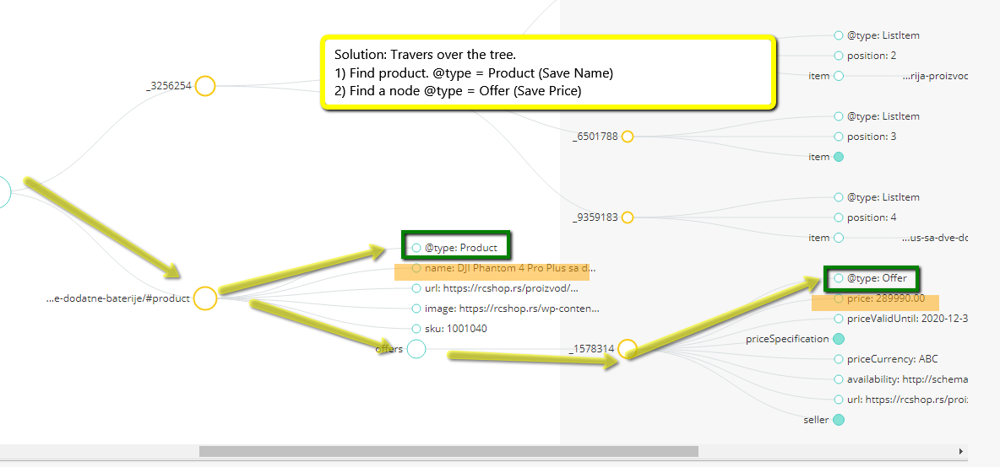

# Rich snippet test tool

I need simple PHP script that will return "Product name" and "Product price" from given url by reading schema (rich snippets from that url).

## Urls

- [Schema main documentation](http://schema.org/docs/gs.html)
- [Product](http://schema.org/Product)
    - [Name](http://schema.org/name)
- [Offer](http://schema.org/Offer)
    - [Price](http://schema.org/price)

## Testing URLS

- https://shop.4audio.rs/shop/slusalice/sennheiser-hd-4-40-bt-wireless/
- https://dijaspora.shop/s-box-plb-2044-nosac-za-zakrivljene-ekrane-3e2cf1a6-e621-3591-87f4-2194fbdc4886
- https://pcfoto.biz/boya-by-dmr7.html
- https://rcshop.rs/proizvod/dji-phantom-4-pro-plus-sa-dve-dodatne-baterije/

## Usage

- `php start.php` - just run in CLI `start.php` scrip.
- `$use_cache = false; // Use caching files or uppload all pages each time.` it's able to turn of a chache, so html content of the pages will be stored in cache files insinde the `price_extractor/cache` folder.
- `$html_cache->clearCacheDirecotry();` it's able to clear cache folder by uncomenting this line.

### Classes:

- `PriceExtractor\Cache\HtmlCache` class that get a list of **urls** and **text files**, create cache for **urls**
-  Stores chache at the `price_extractor/cache` folder has a method `$html_cache->clearCacheDirecotry();` to purge all files and caches
-  Object of this class is iterable and return `html`, `source`, `type` properties.

```php
$sources_list = [
    "https://shop.4audio.rs/shop/slusalice/sennheiser-hd-4-40-bt-wireless/",
];
$html_cache = new PriceExtractor\Cache\HtmlCache($sources_list);


foreach($html_cache as $key => $element){
    echo $key."----------------------\n";
    echo "TYPE: $element->type \n";
    echo "SOURCE: $element->source \n";
    echo "CACHE_FILE_NAME: " . $element->getCacheName() ." \n";
    
    // echo "HTML: $element->html \n";
}

// !important! It is possble to clear the cache folder.
// $html_cache->clearCacheDirecotry();

```

## System implementation.

1. There is a `PriceExtractor\Parser` class. It's constructor requries **html** string, and after parcing it sets **name** and **price** properties.
2. Object of `Parser` class comprice set of `ParseTools` objects, each of them has a `test` method. This method evaluates "Do it possbile to extract name/pice from the incoming html?" At current moment 2 class existed.
3. If there is an object inside `ParceTools` able to extract name and price from the delivered html string, this name and price pair set as **name** and **price** properties of a **Parcer**. If there is no such object, name and price stays unset.
    -  ParseToolDump - class for developers needs.
    - **JsonLd** - class for parsing JsonLd implementation of schema.
    - **Microdata** class to parce Mircrodata pages.

```php

foreach($html_cache as $key => $element){
    echo $key."----------------------\n";
    echo "SOURCE: $element->source \n";
    echo "CACHE_FILE_NAME: " . $element->getCacheName() ." \n";

    $parser = new PriceExtractor\Parser($element->html);

    echo "NAME: $parser->name \n";
    echo "PRICE: $parser->price \n";

}
```

### JSON-LD algorithm:

Seach for `@type == Product` with Depth Frist Search Algorithm, that if @Product is found seach for the `@type == Offer` with second DFS.

- Get **scipt** JSON-LD.
- check **@context == chema.org**
- travers down till find **@type == Product** with **name**
- travers sub tree till find **@type == Offer** with **price**
- 


## TODO and Dairy

[Set of task and implementation of them](dairy.md) - here is a journal of the project.